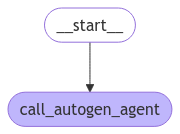

# 如何将LangGraph与AutoGen、CrewAI和其他框架集成

本指南展示了如何将AutoGen智能体与LangGraph集成，以利用持久化、流式传输和内存等功能，然后将集成解决方案部署到LangGraph Platform进行可扩展的生产使用。在本指南中，我们展示了如何构建一个与AutoGen集成的LangGraph聊天机器人，但您可以对其他框架采用相同的方法。

将AutoGen与LangGraph集成提供了几个好处：

- 增强功能：为您的AutoGen智能体添加[持久化](../concepts/persistence.md)、[流式传输](../concepts/streaming.md)、[短期和长期内存](../concepts/memory.md)等功能。
- 多智能体系统：构建[多智能体系统](../concepts/multi_agent.md)，其中各个智能体使用不同的框架构建。
- 生产部署：将您的集成解决方案部署到[LangGraph Platform](../concepts/langgraph_platform.md)进行可扩展的生产使用。

## 先决条件

- Python 3.9+
- Autogen: `pip install autogen`
- LangGraph: `pip install langgraph`
- OpenAI API密钥

## 设置

设置您的环境：

```python
import getpass
import os


def _set_env(var: str):
    if not os.environ.get(var):
        os.environ[var] = getpass.getpass(f"{var}: ")


_set_env("OPENAI_API_KEY")
```

## 1. 定义AutoGen智能体

创建一个可以执行代码的AutoGen智能体。此示例改编自AutoGen的[官方教程](https://github.com/microsoft/autogen/blob/0.2/notebook/agentchat_web_info.ipynb)：

```python
import autogen
import os

config_list = [{"model": "gpt-4o", "api_key": os.environ["OPENAI_API_KEY"]}]

llm_config = {
    "timeout": 600,
    "cache_seed": 42,
    "config_list": config_list,
    "temperature": 0,
}

autogen_agent = autogen.AssistantAgent(
    name="assistant",
    llm_config=llm_config,
)

user_proxy = autogen.UserProxyAgent(
    name="user_proxy",
    human_input_mode="NEVER",
    max_consecutive_auto_reply=10,
    is_termination_msg=lambda x: x.get("content", "").rstrip().endswith("TERMINATE"),
    code_execution_config={
        "work_dir": "web",
        "use_docker": False,
    },  # 如果docker可用，请设置use_docker=True来运行生成的代码。使用docker比直接运行生成的代码更安全。
    llm_config=llm_config,
    system_message="如果任务已完全满意地解决，请回复TERMINATE。否则，回复CONTINUE，或任务尚未解决的原因。",
)
```

## 2. 创建图

我们现在将创建一个调用AutoGen智能体的LangGraph聊天机器人图。

```python
from langchain_core.messages import convert_to_openai_messages
from langgraph.graph import StateGraph, MessagesState, START
from langgraph.checkpoint.memory import InMemorySaver

def call_autogen_agent(state: MessagesState):
    # 将LangGraph消息转换为AutoGen的OpenAI格式
    messages = convert_to_openai_messages(state["messages"])
    
    # 获取最后一条用户消息
    last_message = messages[-1]
    
    # 将之前的消息历史作为上下文传递（排除最后一条消息）
    carryover = messages[:-1] if len(messages) > 1 else []
    
    # 启动与AutoGen的聊天
    response = user_proxy.initiate_chat(
        autogen_agent,
        message=last_message,
        carryover=carryover
    )
    
    # 从智能体中提取最终响应
    final_content = response.chat_history[-1]["content"]
    
    # 以LangGraph格式返回响应
    return {"messages": {"role": "assistant", "content": final_content}}

# 创建带有内存的图以实现持久化
checkpointer = InMemorySaver()

# 构建图
builder = StateGraph(MessagesState)
builder.add_node("autogen", call_autogen_agent)
builder.add_edge(START, "autogen")

# 使用检查点器编译以实现持久化
graph = builder.compile(checkpointer=checkpointer)
```

```python
from IPython.display import display, Image

display(Image(graph.get_graph().draw_mermaid_png()))
```



## 3. 本地测试图

在部署到LangGraph Platform之前，您可以在本地测试图：

```python
# 传递线程ID以持久化智能体输出供未来交互使用
# highlight-next-line
config = {"configurable": {"thread_id": "1"}}

for chunk in graph.stream(
    {
        "messages": [
            {
                "role": "user",
                "content": "在斐波那契数列中找到10到30之间的数字",
            }
        ]
    },
    # highlight-next-line
    config,
):
    print(chunk)
```

**输出：**
```
user_proxy (to assistant):

在斐波那契数列中找到10到30之间的数字

--------------------------------------------------------------------------------
assistant (to user_proxy):

要在斐波那契数列中找到10到30之间的数字，我们可以生成斐波那契数列并检查哪些数字落在这个范围内。以下是计划：

1. 从0开始生成斐波那契数。
2. 继续生成直到数字超过30。
3. 收集并打印在10到30之间的数字。

...
```

由于我们利用了LangGraph的[持久化](https://langchain-ai.github.io/langgraph/concepts/persistence/)功能，我们现在可以使用相同的线程ID继续对话——LangGraph将自动将之前的历史传递给AutoGen智能体：

```python
for chunk in graph.stream(
    {
        "messages": [
            {
                "role": "user",
                "content": "将最后一个数字乘以3",
            }
        ]
    },
    # highlight-next-line
    config,
):
    print(chunk)
```

**输出：**
```
user_proxy (to assistant):

将最后一个数字乘以3
上下文: 
在斐波那契数列中找到10到30之间的数字
斐波那契数列中10到30之间的数字是13和21。

这些数字是斐波那契数列的一部分，斐波那契数列是通过将前两个数字相加得到下一个数字生成的，从0和1开始。

序列如下：0, 1, 1, 2, 3, 5, 8, 13, 21, 34, ...

如您所见，13和21是这个序列中唯一落在10到30之间的数字。

TERMINATE

--------------------------------------------------------------------------------
assistant (to user_proxy):

斐波那契数列中10到30之间的最后一个数字是21。将21乘以3得到：

21 * 3 = 63

TERMINATE

--------------------------------------------------------------------------------
{'call_autogen_agent': {'messages': {'role': 'assistant', 'content': '斐波那契数列中10到30之间的最后一个数字是21。将21乘以3得到：\n\n21 * 3 = 63\n\nTERMINATE'}}}
``` 

## 4. 准备部署

要部署到LangGraph Platform，请创建如下文件结构：

```
my-autogen-agent/
├── agent.py          # 您的主要智能体代码
├── requirements.txt  # Python依赖项
└── langgraph.json   # LangGraph配置
```

=== "agent.py"

    ```python
    import os
    import autogen
    from langchain_core.messages import convert_to_openai_messages
    from langgraph.graph import StateGraph, MessagesState, START
    from langgraph.checkpoint.memory import InMemorySaver

    # AutoGen配置
    config_list = [{"model": "gpt-4o", "api_key": os.environ["OPENAI_API_KEY"]}]

    llm_config = {
        "timeout": 600,
        "cache_seed": 42,
        "config_list": config_list,
        "temperature": 0,
    }

    # 创建AutoGen智能体
    autogen_agent = autogen.AssistantAgent(
        name="assistant",
        llm_config=llm_config,
    )

    user_proxy = autogen.UserProxyAgent(
        name="user_proxy",
        human_input_mode="NEVER",
        max_consecutive_auto_reply=10,
        is_termination_msg=lambda x: x.get("content", "").rstrip().endswith("TERMINATE"),
        code_execution_config={
            "work_dir": "/tmp/autogen_work",
            "use_docker": False,
        },
        llm_config=llm_config,
        system_message="如果任务已完全满意地解决，请回复TERMINATE。",
    )

    def call_autogen_agent(state: MessagesState):
        """调用AutoGen智能体的节点函数"""
        messages = convert_to_openai_messages(state["messages"])
        last_message = messages[-1]
        carryover = messages[:-1] if len(messages) > 1 else []
        
        response = user_proxy.initiate_chat(
            autogen_agent,
            message=last_message,
            carryover=carryover
        )
        
        final_content = response.chat_history[-1]["content"]
        return {"messages": {"role": "assistant", "content": final_content}}

    # 创建并编译图
    def create_graph():
        checkpointer = InMemorySaver()
        builder = StateGraph(MessagesState)
        builder.add_node("autogen", call_autogen_agent)
        builder.add_edge(START, "autogen")
        return builder.compile(checkpointer=checkpointer)

    # 导出图以供LangGraph Platform使用
    graph = create_graph()
    ```

=== "requirements.txt"

    ```
    langgraph>=0.1.0
    ag2>=0.2.0
    langchain-core>=0.1.0
    langchain-openai>=0.0.5
    ```

=== "langgraph.json"

    ```json
    {
    "dependencies": ["."],
    "graphs": {
        "autogen_agent": "./agent.py:graph"
    },
    "env": ".env"
    }
    ```


## 5. 部署到LangGraph Platform

使用LangGraph Platform CLI部署图：

```
pip install -U langgraph-cli
```

```
langgraph deploy --config langgraph.json 
```
