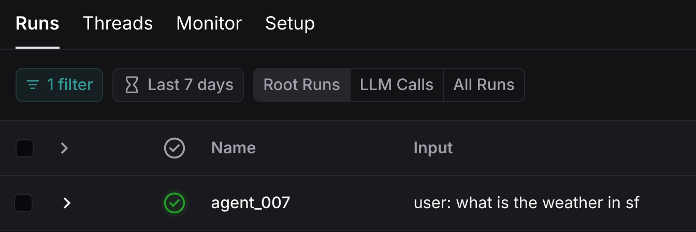
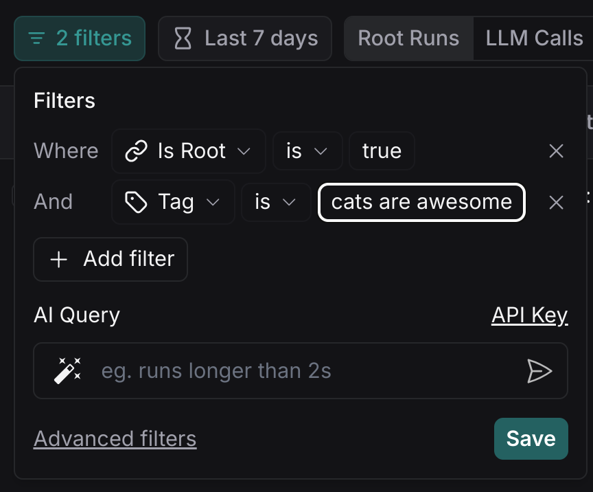

# 如何在 LangSmith 中为图运行传递自定义运行 ID 或设置标签和元数据

!!! tip "先决条件"
    本指南假设您熟悉以下内容：
    
    - [LangSmith 文档](https://docs.smith.langchain.com)
    - [LangSmith 平台](https://smith.langchain.com)
    - [RunnableConfig](https://api.python.langchain.com/en/latest/runnables/langchain_core.runnables.config.RunnableConfig.html#langchain_core.runnables.config.RunnableConfig)
    - [向跟踪添加元数据和标签](https://docs.smith.langchain.com/how_to_guides/tracing/trace_with_langchain#add-metadata-and-tags-to-traces)
    - [自定义运行名称](https://docs.smith.langchain.com/how_to_guides/tracing/trace_with_langchain#customize-run-name)

在 IDE 或终端中调试图运行有时可能很困难。[LangSmith](https://docs.smith.langchain.com) 让您使用跟踪数据来调试、测试和监控使用 LangGraph 构建的 LLM 应用程序——阅读[LangSmith 文档](https://docs.smith.langchain.com)了解如何开始。

为了更容易识别和分析在图调用期间生成的跟踪，您可以在运行时设置附加配置（请参阅[RunnableConfig](https://api.python.langchain.com/en/latest/runnables/langchain_core.runnables.config.RunnableConfig.html#langchain_core.runnables.config.RunnableConfig)）：

| **字段**   | **类型**            | **描述**                                                                                                    |
|-------------|---------------------|--------------------------------------------------------------------------------------------------------------------|
| run_name    | `str`               | 此调用的跟踪器运行名称。默认为类名。                                          |
| run_id      | `UUID`              | 此调用的跟踪器运行的唯一标识符。如果未提供，将生成新的 UUID。                 |
| tags        | `List[str]`         | 此调用和任何子调用的标签（例如，链调用 LLM）。您可以使用这些来过滤调用。            |
| metadata    | `Dict[str, Any]`    | 此调用和任何子调用的元数据（例如，链调用 LLM）。键应该是字符串，值应该是 JSON 可序列化的。 |

LangGraph 图实现了[LangChain Runnable 接口](https://python.langchain.com/api_reference/core/runnables/langchain_core.runnables.base.Runnable.html)，并在`invoke`、`ainvoke`、`stream`等方法中接受第二个参数（`RunnableConfig`）。

LangSmith 平台将允许您基于`run_name`、`run_id`、`tags`和`metadata`搜索和过滤跟踪。

## 快速开始

```python
import uuid
# Generate a random UUID -- it must be a UUID
config = {"run_id": uuid.uuid4()}, "tags": ["my_tag1"], "metadata": {"a": 5}}
# Works with all standard Runnable methods 
# like invoke, batch, ainvoke, astream_events etc
graph.stream(inputs, config, stream_mode="values")
```

The rest of the how to guide will show a full agent.

## Setup

First, let's install the required packages and set our API keys

```python
%%capture --no-stderr
%pip install --quiet -U langgraph langchain_openai
```

```python
import getpass
import os


def _set_env(var: str):
    if not os.environ.get(var):
        os.environ[var] = getpass.getpass(f"{var}: ")


_set_env("OPENAI_API_KEY")
_set_env("LANGSMITH_API_KEY")
```

!!! tip
    Sign up for LangSmith to quickly spot issues and improve the performance of your LangGraph projects. [LangSmith](https://docs.smith.langchain.com) lets you use trace data to debug, test, and monitor your LLM apps built with LangGraph — read more about how to get started [here](https://docs.smith.langchain.com).

## Define the graph

For this example we will use the [prebuilt ReAct agent](https://langchain-ai.github.io/langgraph/how-tos/create-react-agent/).

```python
from langchain_openai import ChatOpenAI
from typing import Literal
from langgraph.prebuilt import create_react_agent
from langchain_core.tools import tool

# First we initialize the model we want to use.
model = ChatOpenAI(model="gpt-4o", temperature=0)


# For this tutorial we will use custom tool that returns pre-defined values for weather in two cities (NYC & SF)
@tool
def get_weather(city: Literal["nyc", "sf"]):
    """Use this to get weather information."""
    if city == "nyc":
        return "It might be cloudy in nyc"
    elif city == "sf":
        return "It's always sunny in sf"
    else:
        raise AssertionError("Unknown city")


tools = [get_weather]


# Define the graph
graph = create_react_agent(model, tools=tools)
```

## Run your graph

Now that we've defined our graph let's run it once and view the trace in LangSmith. In order for our trace to be easily accessible in LangSmith, we will pass in a custom `run_id` in the config.

This assumes that you have set your `LANGSMITH_API_KEY` environment variable.

Note that you can also configure what project to trace to by setting the `LANGCHAIN_PROJECT` environment variable, by default runs will be traced to the `default` project.

```python
import uuid


def print_stream(stream):
    for s in stream:
        message = s["messages"][-1]
        if isinstance(message, tuple):
            print(message)
        else:
            message.pretty_print()


inputs = {"messages": [("user", "what is the weather in sf")]}

config = {"run_name": "agent_007", "tags": ["cats are awesome"]}

print_stream(graph.stream(inputs, config, stream_mode="values"))
```

**Output:**
```
================================ Human Message ==================================

what is the weather in sf
================================== Ai Message ===================================
Tool Calls:
  get_weather (call_9ZudXyMAdlUjptq9oMGtQo8o)
 Call ID: call_9ZudXyMAdlUjptq9oMGtQo8o
  Args:
    city: sf
================================= Tool Message ==================================
Name: get_weather

It's always sunny in sf
================================== Ai Message ===================================

The weather in San Francisco is currently sunny.
```

## View the trace in LangSmith

Now that we've ran our graph, let's head over to LangSmith and view our trace. First click into the project that you traced to (in our case the default project). You should see a run with the custom run name "agent_007".



In addition, you will be able to filter traces after the fact using the tags or metadata provided. For example,

 
