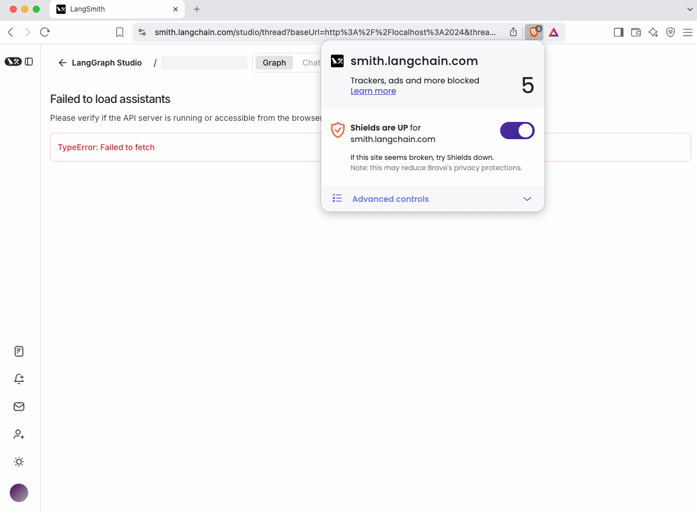

# LangGraph Studio 故障排除

## :fontawesome-brands-safari:{ .safari } Safari 连接问题

Safari 会阻止 localhost 上的纯 HTTP 流量。当使用 `langgraph dev` 运行 Studio 时，您可能会看到"Failed to load assistants"错误。

### 解决方案 1：使用 Cloudflare 隧道

:::python

```shell
pip install -U langgraph-cli>=0.2.6
langgraph dev --tunnel
```

:::

:::js

```shell
npx @langchain/langgraph-cli dev
```

:::

该命令会输出以下格式的 URL：

```shell
https://smith.langchain.com/studio/?baseUrl=https://hamilton-praise-heart-costumes.trycloudflare.com
```

在 Safari 中使用此 URL 来加载 Studio。这里，`baseUrl` 参数指定您的代理服务器端点。

### 解决方案 2：使用 Chromium 浏览器

Chrome 和其他 Chromium 浏览器允许 localhost 上的 HTTP 流量。使用 `langgraph dev` 无需额外配置。

## :fontawesome-brands-brave:{ .brave } Brave 连接问题

当启用 Brave Shields 时，Brave 会阻止 localhost 上的纯 HTTP 流量。当使用 `langgraph dev` 运行 Studio 时，您可能会看到"Failed to load assistants"错误。

### 解决方案 1：禁用 Brave Shields

使用 URL 栏中的 Brave 图标为 LangSmith 禁用 Brave Shields。



### 解决方案 2：使用 Cloudflare 隧道

:::python

```shell
pip install -U langgraph-cli>=0.2.6
langgraph dev --tunnel
```

:::

:::js

```shell
npx @langchain/langgraph-cli dev
```

:::

该命令会输出以下格式的 URL：

```shell
https://smith.langchain.com/studio/?baseUrl=https://hamilton-praise-heart-costumes.trycloudflare.com
```

在 Brave 中使用此 URL 来加载 Studio。这里，`baseUrl` 参数指定您的代理服务器端点。

## 图边问题

:::python
未定义的条件边可能会在您的图中显示意外的连接。这是因为如果没有正确定义，LangGraph Studio 会假设条件边可以访问所有其他节点。要解决此问题，请使用以下方法之一明确定义路由路径：

### 解决方案 1：路径映射

定义路由器输出和目标节点之间的映射：

```python
graph.add_conditional_edges("node_a", routing_function, {True: "node_b", False: "node_c"})
```

### 解决方案 2：路由器类型定义（Python）

使用 Python 的 `Literal` 类型指定可能的路由目标：

```python
def routing_function(state: GraphState) -> Literal["node_b","node_c"]:
    if state['some_condition'] == True:
        return "node_b"
    else:
        return "node_c"
```

:::

:::js
未定义的条件边可能会在您的图中显示意外的连接。这是因为如果没有正确定义，LangGraph Studio 会假设条件边可以访问所有其他节点。
要解决此问题，请明确定义路由器输出和目标节点之间的映射：

```typescript
graph.addConditionalEdges("node_a", routingFunction, {
  true: "node_b",
  false: "node_c",
});
```

:::
