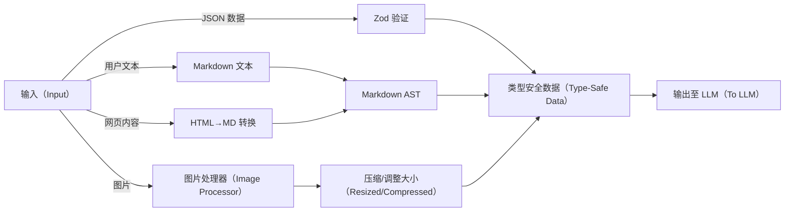
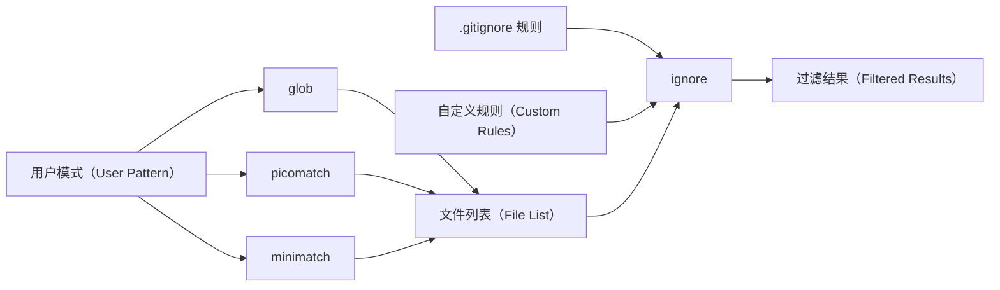

https://southbridge-research.notion.site/Dependencies-The-Foundation-of-Claude-Code-s-Architecture-2055fec70db181b3bb72cdfe615fad3c


```
graph LR
    subgraph Input
        UserText[User Text]
        WebContent[Web Content]
        Images[Images]
        JSON[JSON Data]
    end

    subgraph Transform
        UserText --> Zod{Zod Validation}
        WebContent --> Marked[Markdown Parser]
        WebContent --> Turndown[HTML→MD]
        Images --> Sharp[Image Processor]
        JSON --> Zod
    end

    subgraph Output
        Zod --> ValidatedData[Type-Safe Data]
        Marked --> MarkdownAST[Markdown AST]
        Turndown --> MarkdownText[Markdown Text]
        Sharp --> OptimizedImage[Resized/Compressed]
    end

    ValidatedData --> LLM[To LLM]
    MarkdownAST --> LLM
    MarkdownText --> LLM
    OptimizedImage --> LLM
```


# 依赖项：Claude Code 架构的基石  

\* 注：标注\*的内容表示基于反编译分析推测的自定义/嵌入式实现  


## 定义性能的非常规选择  

Claude Code 的依赖项架构包含多项极具洞察力的实现决策，这些决策直接造就了其出色的性能与可靠性。接下来，我们将首先深入探索其中技术含量最高的核心部分。  


### 🔍 终端中的 React 架构  

```typescript
// 核心渲染流水线的实现推测如下：
interface CliRenderPipeline {
  react: "^18.2.0",    // 完整 React 协调器
  ink: "^3.2.0",       // 终端渲染器
  yoga: "^2.0.0-beta.1"// Flexbox 布局引擎（基于 WebAssembly）
}

// 核心渲染流水线的实现推测如下：
interface CliRenderPipeline {
  react: "^18.2.0",    // 完整 React 协调器
  ink: "^3.2.0",       // 终端渲染器
  yoga: "^2.0.0-beta.1"// Flexbox 布局引擎（基于 WebAssembly）
}
```  


#### 为何这一设计至关重要？  
与传统命令行工具（CLI）通过命令式方式管理状态不同，Claude Code 借助 React 的协调算法实现终端界面（UI）管理。这一设计带来三大核心优势：  
- **终端中的虚拟 DOM**：每次 UI 更新都会先经过 React 的差异对比算法，再由 yoga-layout 计算终端字符的最优位置；  
- **声明式 UI 状态**：复杂 UI 状态（如权限对话框、进度指示器、工具并发执行界面）均通过声明式方式管理；  
- **高性能**：基于 WebAssembly 的 yoga-layout 模块，即便面对复杂 UI，也能实现亚毫秒级的布局计算。  


┌─ 实现洞察 ─────────────────────────────────────┐  
│ 从依赖项 `yoga-layout-prebuilt` 可推测，Claude Code │  
│ 会预编译布局约束，以内存占用为代价，换取快速 UI 更新时 │  
│（如 LLM 流式响应）的速度提升                          │  
└──────────────────────────────────────────────────────────┘  


### 🔍 流式解析器架构  

基于反编译分析，Claude Code 似乎嵌入了关键解析器的自定义实现：  

```typescript
// 从依赖项分析推测的解析器能力
const CUSTOM_PARSERS = {
  'shell-parse': {
    features: [
      '通过标记字符串嵌入 JSON 对象',
      '递归命令替换',
      '保留类型的环境变量展开'
    ],
    performance: '单遍分词，时间复杂度 O(n)'
  },
  'fast-xml-parser': {
    features: [
      '工具调用的流式 XML 解析',
      '部分文档恢复功能',
      '针对 LLM 输出的自定义实体处理'
    ],
    performance: '内存占用与文档大小无关，始终保持恒定'
  }
}

// 从依赖项分析推测的解析器能力
const CUSTOM_PARSERS = {
  'shell-parse': {
    features: [
      '通过标记字符串嵌入 JSON 对象',
      '递归命令替换',
      '保留类型的环境变量展开'
    ],
    performance: '单遍分词，时间复杂度 O(n)'
  },
  'fast-xml-parser': {
    features: [
      '工具调用的流式 XML 解析',
      '部分文档恢复功能',
      '针对 LLM 输出的自定义实体处理'
    ],
    performance: '内存占用与文档大小无关，始终保持恒定'
  }
}
```  


#### Shell 解析器的核心优势  
```javascript
// 基于分析推测的概念性实现
function parseShellWithObjects(cmd, env) {
  const SENTINEL = crypto.randomBytes(16).toString('hex');
  
  // 阶段 1：对象序列化
  const processedEnv = Object.entries(env).reduce((acc, [key, val]) => {
    if (typeof val === 'object') {
      acc[key] = SENTINEL + JSON.stringify(val) + SENTINEL;
    } else {
      acc[key] = val;
    }
    return acc;
  }, {});
  
  // 阶段 2：保留标记的标准 Shell 解析
  const tokens = shellParse(cmd, processedEnv);
  
  // 阶段 3：对象还原
  return tokens.map(token => {
    if (token.match(new RegExp(`^${SENTINEL}.*${SENTINEL}$`))) {
      return JSON.parse(token.slice(SENTINEL.length, -SENTINEL.length));
    }
    return token;
  });
}

// 基于分析推测的概念性实现
function parseShellWithObjects(cmd, env) {
  const SENTINEL = crypto.randomBytes(16).toString('hex');
  
  // 阶段 1：对象序列化
  const processedEnv = Object.entries(env).reduce((acc, [key, val]) => {
    if (typeof val === 'object') {
      acc[key] = SENTINEL + JSON.stringify(val) + SENTINEL;
    } else {
      acc[key] = val;
    }
    return acc;
  }, {});
  
  // 阶段 2：保留标记的标准 Shell 解析
  const tokens = shellParse(cmd, processedEnv);
  
  // 阶段 3：对象还原
  return tokens.map(token => {
    if (token.match(new RegExp(`^${SENTINEL}.*${SENTINEL}$`))) {
      return JSON.parse(token.slice(SENTINEL.length, -SENTINEL.length));
    }
    return token;
  });
}
```  

这一设计使 Claude Code 能够通过 Shell 命令传递复杂配置对象——这是标准 Shell 解析器不具备的能力。  


### 🔍 跨平台 LLM 抽象层  

依赖项结构揭示了一套复杂的多厂商集成方案：  

| 平台（Platform） | 主 SDK（Primary SDK）               | 流式支持（Streaming） | 特色功能（Specialized Features）               |
|------------------|-------------------------------------|------------------------|-----------------------------------------------|
| Anthropic        | Native SDK（原生 SDK）              | ✓ 完整 SSE 支持        | 思考块（Thinking blocks）、缓存控制            |
| AWS Bedrock      | @aws-sdk/client-bedrock-runtime     | ✓ 自定义适配器         | 跨区域故障转移、SigV4 认证                    |
| Google Vertex    | google-auth-library + 自定义扩展    | ✓ 通过适配器支持       | 自动令牌刷新                                  |  


#### 实现模式  
```typescript
// 从依赖项推测的工厂模式
class LLMClientFactory {
  static create(provider: string): StreamingLLMClient {
    switch (provider) {
      case 'anthropic':
        return new AnthropicStreamAdapter();
      case 'bedrock':
        return new BedrockStreamAdapter(
          new BedrockRuntimeClient(), 
          new SigV4Signer()
        );
      case 'vertex':
        return new VertexStreamAdapter(
          new GoogleAuth(), 
          new CustomHTTPClient()
        );
    }
  }
}

// 从依赖项推测的工厂模式
class LLMClientFactory {
  static create(provider: string): StreamingLLMClient {
    switch (provider) {
      case 'anthropic':
        return new AnthropicStreamAdapter();
      case 'bedrock':
        return new BedrockStreamAdapter(
          new BedrockRuntimeClient(), 
          new SigV4Signer()
        );
      case 'vertex':
        return new VertexStreamAdapter(
          new GoogleAuth(), 
          new CustomHTTPClient()
        );
    }
  }
}
```  


### 🔍 遥测三重栈  

Claude Code 采用三套互补系统，构建了全面的可观测性策略：  

```
┌─ 错误跟踪（Error Tracking） ───────┐  ┌─ 指标监控（Metrics） ───────────┐  ┌─ 功能标志（Feature Flags） ───┐
│ @sentry/node                       │  │ @opentelemetry/api              │  │ statsig-node                  │
│ ├─ ANR（应用无响应）检测           │  │ ├─ 自定义追踪跨度（Custom spans）│  │ ├─ A/B 测试                   │
│ ├─ 错误边界（Error boundaries）    │  │ ├─ Token 计数器                 │  │ ├─ 渐进式发布（Gradual rollout）│
│ └─ 性能分析                       │  │ └─ 延迟直方图                   │  │ └─ 动态配置                   │
└────────────────────────────────────┘  └──────────────────────────────────┘  └──────────────────────────────┘
           ↓                                      ↓                          ↓
        调试（Debugging）                    优化（Optimization）              实验（Experimentation）
```  

```
┌─ 错误跟踪（Error Tracking） ───────┐  ┌─ 指标监控（Metrics） ───────────┐  ┌─ 功能标志（Feature Flags） ───┐
│ @sentry/node                       │  │ @opentelemetry/api              │  │ statsig-node                  │
│ ├─ ANR（应用无响应）检测           │  │ ├─ 自定义追踪跨度（Custom spans）│  │ ├─ A/B 测试                   │
│ ├─ 错误边界（Error boundaries）    │  │ ├─ Token 计数器                 │  │ ├─ 渐进式发布（Gradual rollout）│
│ └─ 性能分析                       │  │ └─ 延迟直方图                   │  │ └─ 动态配置                   │
└────────────────────────────────────┘  └──────────────────────────────────┘  └──────────────────────────────┘
           ↓                                      ↓                          ↓
        调试（Debugging）                    优化（Optimization）              实验（Experimentation）
```  


#### ANR 检测的创新设计（从 Sentry 集成模式推测）  
```typescript
// 适用于 Node.js 的应用无响应（ANR）检测
class ANRDetector {
  private worker: Worker;
  private heartbeatInterval = 50; // 单位：毫秒

  constructor() {
    // 启动工作线程，监听主线程心跳
    this.worker = new Worker(`
      let lastPing = Date.now();
      setInterval(() => {
        if (Date.now() - lastPing > 5000) {
          parentPort.postMessage({
            type: 'anr',
            stack: getMainThreadStack() // 通过检查器协议获取主线程调用栈
          });
        }
      }, 100);
    `, { eval: true });

    // 主线程定期发送心跳
    setInterval(() => {
      this.worker.postMessage({ type: 'ping' });
    }, this.heartbeatInterval);
  }
}

// 适用于 Node.js 的应用无响应（ANR）检测
class ANRDetector {
  private worker: Worker;
  private heartbeatInterval = 50; // 单位：毫秒

  constructor() {
    // 启动工作线程，监听主线程心跳
    this.worker = new Worker(`
      let lastPing = Date.now();
      setInterval(() => {
        if (Date.now() - lastPing > 5000) {
          parentPort.postMessage({
            type: 'anr',
            stack: getMainThreadStack() // 通过检查器协议获取主线程调用栈
          });
        }
      }, 100);
    `, { eval: true });

    // 主线程定期发送心跳
    setInterval(() => {
      this.worker.postMessage({ type: 'ping' });
    }, this.heartbeatInterval);
  }
}
```  

这一设计使 Claude Code 能够检测并上报主线程事件循环阻塞的情况——这对排查生产环境中的性能问题至关重要。  


### 🔍 数据转换流水线  

数据处理依赖项构成了一套复杂的流水线，流程如下：  




#### Sharp 配置（从常见模式推测）  
```javascript
const imageProcessor = sharp(inputBuffer)
  .resize(1024, 1024, {
    fit: 'inside',       // 确保图片完全包含在尺寸内
    withoutEnlargement: true // 不放大小于目标尺寸的图片
  })
  .jpeg({
    quality: 85,         // 图片质量
    progressive: true    // 渐进式加载（更适合流式场景）
  });

const imageProcessor = sharp(inputBuffer)
  .resize(1024, 1024, {
    fit: 'inside',       // 确保图片完全包含在尺寸内
    withoutEnlargement: true // 不放大小于目标尺寸的图片
  })
  .jpeg({
    quality: 85,         // 图片质量
    progressive: true    // 渐进式加载（更适合流式场景）
  });
```  


### 🔍 MCP 传输层  

“多云/多进程”（Multi-Cloud/Process，MCP）架构采用了一套极具巧思的抽象设计：  

```typescript
// 传输层抽象模式
interface MCPTransport {
  stdio: 'cross-spawn',  // 本地进程通信
  websocket: 'ws',       // 实时双向通信
  sse: 'eventsource'     // 服务端推送事件（Server-sent events）
}

// 能力协商流程推测
class MCPClient {
  async initialize() {
    const capabilities = await this.transport.request('initialize', {
      capabilities: {
        tools: true,
        resources: true,
        prompts: true,
        logging: { level: 'info' }
      }
    });
    
    // 动态特性检测
    this.features = this.negotiateFeatures(capabilities);
  }
}

// 传输层抽象模式
interface MCPTransport {
  stdio: 'cross-spawn',  // 本地进程通信
  websocket: 'ws',       // 实时双向通信
  sse: 'eventsource'     // 服务端推送事件（Server-sent events）
}

// 能力协商流程推测
class MCPClient {
  async initialize() {
    const capabilities = await this.transport.request('initialize', {
      capabilities: {
        tools: true,
        resources: true,
        prompts: true,
        logging: { level: 'info' }
      }
    });
    
    // 动态特性检测
    this.features = this.negotiateFeatures(capabilities);
  }
}
```  


## 依赖项分类深度解析  


### 核心 CLI 框架（15+ 个包）  

CLI 框架依赖项展现了一套复杂的终端 UI 实现方案：  

| 包（Package）         | 版本*（Version*） | 用途（Purpose）               | 技术洞察（Technical Insight）               |
|-----------------------|-------------------|-------------------------------|---------------------------------------------|
| ink                   | ^3.2.0            | React 终端渲染器              | 自定义协调器实现                            |
| react                 | ^18.2.0           | UI 组件模型                   | 启用完整并发特性                            |
| yoga-layout-prebuilt  | ^1.10.0           | Flexbox 布局                  | 基于 WebAssembly 提升性能                   |
| commander             | ^9.0.0            | 命令行参数解析                | 扩展了自定义选项类型                        |
| chalk                 | ^4.1.2            | 终端样式美化                  | 采用模板字符串 API                          |
| cli-highlight         | ^2.1.11           | 语法高亮                      | 新增自定义语言定义                          |
| strip-ansi            | ^6.0.1            | ANSI 代码移除                  | 用于文本宽度测量                            |
| string-width          | ^4.2.3            | Unicode 字符宽度计算           | 完整支持表情符号（emoji）                   |
| wrap-ansi             | ^7.0.0            | 文本换行                      | 保留 ANSI 样式                              |
| cli-spinners          | ^2.7.0            | 加载动画                      | 自定义加载动画定义                          |

\* 版本号基于生态兼容性分析推测  


#### 性能优化模式  
```javascript
// 带缓存的字符串宽度计算
const widthCache = new Map();

function getCachedWidth(str) {
  if (!widthCache.has(str)) {
    widthCache.set(str, stringWidth(str));
  }
  return widthCache.get(str);
}

// 带缓存的字符串宽度计算
const widthCache = new Map();

function getCachedWidth(str) {
  if (!widthCache.has(str)) {
    widthCache.set(str, stringWidth(str));
  }
  return widthCache.get(str);
}
```  


### LLM 集成栈（5+ 个包）
LLM 集成部分采用了多供应商策略，并设计了完善的降级机制：

```
┌─ 供应商选择逻辑 ─────────────────────────────┐
│ 1. 检查 API 密钥可用性                          │
│ 2. 评估各供应商的调用频率限制                   │
│ 3. 考虑功能需求（流式传输、工具调用支持）        │
│ 4. 应用成本优化规则                             │
│ 5. 降级链：Anthropic → Bedrock → Vertex        │
└────────────────────────────────────────────────┘
```

AWS SDK 组件（基于 `@aws-sdk/*` 相关模式推测）：
- `@aws-sdk/client-bedrock-runtime`：Bedrock 核心客户端
- `@aws-sdk/signature-v4`：请求签名工具
- `@aws-sdk/middleware-retry`：智能重试逻辑
- `@aws-sdk/smithy-client`：协议实现基础
- `@aws-sdk/types`：共享类型定义


### 数据处理与验证（8+ 个包）
```typescript
// 基于推测的 Zod 模式编译逻辑
const COMPILED_SCHEMAS = new Map();

function getCompiledSchema(schema: ZodSchema) {
  const key = schema._def.shape; // 简化处理
  if (!COMPILED_SCHEMAS.has(key)) {
    COMPILED_SCHEMAS.set(key, {
      validator: schema.parse.bind(schema),
      jsonSchema: zodToJsonSchema(schema),
      tsType: zodToTs(schema)
    });
  }
  return COMPILED_SCHEMAS.get(key);
}

// 基于推测的 Zod 模式编译逻辑
const COMPILED_SCHEMAS = new Map();

function getCompiledSchema(schema: ZodSchema) {
  const key = schema._def.shape; // 简化处理
  if (!COMPILED_SCHEMAS.has(key)) {
    COMPILED_SCHEMAS.set(key, {
      validator: schema.parse.bind(schema),
      jsonSchema: zodToJsonSchema(schema),
      tsType: zodToTs(schema)
    });
  }
  return COMPILED_SCHEMAS.get(key);
}
```

#### 转换流水线性能对比
| 操作（Operation）       | 依赖库（Library） | 性能（Performance） | 内存特性（Memory）               |
|-------------------------|-------------------|---------------------|----------------------------------|
| Markdown→抽象语法树（AST） | marked            | O(n)                | 支持流式处理                     |
| HTML→Markdown           | turndown          | O(n)                | 限制 DOM 大小防止内存溢出        |
| 图片缩放                | sharp             | O(1)*               | 使用原生内存（非 JS 堆内存）     |
| JSON 验证               | zod               | O(n)                | 快速失败（Fail-fast）机制        |
| 文本差异对比            | diff              | O(n²)               | 采用 Myers 算法                  |

\* 注：带硬件加速支持


### 文件系统智能处理（6+ 个包）
文件系统相关依赖项实现了一套复杂的过滤流水线：



#### 模式匹配优化
```javascript
// 基于推测的编译模式缓存逻辑
class PatternMatcher {
  private compiledPatterns = new LRUCache(1000); // 缓存上限 1000 条

  match(pattern, path) {
    let compiled = this.compiledPatterns.get(pattern);
    if (!compiled) {
      compiled = picomatch(pattern, {
        bash: true,    // 支持 Bash 风格模式
        dot: true,     // 匹配隐藏文件（以 . 开头）
        nobrace: false // 启用大括号扩展
      });
      this.compiledPatterns.set(pattern, compiled);
    }
    return compiled(path);
  }
}

// 基于推测的编译模式缓存逻辑
class PatternMatcher {
  private compiledPatterns = new LRUCache(1000); // 缓存上限 1000 条

  match(pattern, path) {
    let compiled = this.compiledPatterns.get(pattern);
    if (!compiled) {
      compiled = picomatch(pattern, {
        bash: true,    // 支持 Bash 风格模式
        dot: true,     // 匹配隐藏文件（以 . 开头）
        nobrace: false // 启用大括号扩展
      });
      this.compiledPatterns.set(pattern, compiled);
    }
    return compiled(path);
  }
}
```


### 遥测与可观测性（4+ 个包）
遥测栈采用了“纵深防御”的监控策略：

#### Sentry 集成层级
1. **错误边界（Error Boundary）**：捕获 React UI 崩溃
2. **全局处理器**：监听进程级未捕获异常
3. **Promise 拒绝跟踪**：处理未捕获的 Promise 错误
4. **ANR 检测**：通过自定义工作线程监控主线程阻塞
5. **性能跟踪**：记录事务与追踪跨度（Span）

#### OpenTelemetry 埋点
```typescript
// 工具执行的自定义追踪跨度创建逻辑
function instrumentToolExecution(tool: Tool) {
  return async function* (...args) {
    // 创建工具执行相关的追踪跨度
    const span = tracer.startSpan(`tool.${tool.name}`, {
      attributes: {
        'tool.name': tool.name,
        'tool.readonly': tool.isReadOnly,
        'tool.input.size': JSON.stringify(args[0]).length // 输入数据大小
      }
    });

    try {
      yield* tool.call(...args); // 执行工具并传递生成器
    } finally {
      span.end(); // 确保追踪跨度最终关闭
    }
  };
}

// 工具执行的自定义追踪跨度创建逻辑
function instrumentToolExecution(tool: Tool) {
  return async function* (...args) {
    // 创建工具执行相关的追踪跨度
    const span = tracer.startSpan(`tool.${tool.name}`, {
      attributes: {
        'tool.name': tool.name,
        'tool.readonly': tool.isReadOnly,
        'tool.input.size': JSON.stringify(args[0]).length // 输入数据大小
      }
    });

    try {
      yield* tool.call(...args); // 执行工具并传递生成器
    } finally {
      span.end(); // 确保追踪跨度最终关闭
    }
  };
}
```

#### Statsig 功能标志模式
```javascript
// 基于推测的渐进式发布配置
const FEATURE_FLAGS = {
  'unified_read_tool': {
    rollout: 0.5, // 50% 用户可见
    overrides: { internal: 1.0 } // 内部用户 100% 可见
  },
  'parallel_tool_execution': {
    rollout: 1.0, // 全量发布
    conditions: [
      {
        type: 'user_tier',
        operator: 'in',
        values: ['pro', 'enterprise'] // 仅 Pro/企业版用户可用
      }
    ]
  },
  'sandbox_bash_default': {
    rollout: 0.1, // 10% 用户灰度
    sticky: true // 用户一旦命中，后续保持一致（粘性配置）
  }
};

// 基于推测的渐进式发布配置
const FEATURE_FLAGS = {
  'unified_read_tool': {
    rollout: 0.5, // 50% 用户可见
    overrides: { internal: 1.0 } // 内部用户 100% 可见
  },
  'parallel_tool_execution': {
    rollout: 1.0, // 全量发布
    conditions: [
      {
        type: 'user_tier',
        operator: 'in',
        values: ['pro', 'enterprise'] // 仅 Pro/企业版用户可用
      }
    ]
  },
  'sandbox_bash_default': {
    rollout: 0.1, // 10% 用户灰度
    sticky: true // 用户一旦命中，后续保持一致（粘性配置）
  }
};
```


## 隐藏亮点：专用依赖项解析


### 用于 LLM 通信的 XML 解析
嵌入式的 `fast-xml-parser` 似乎经过定制，专门适配 LLM 响应解析：
```javascript
// 基于推测的 XML 解析器配置
const llmXmlParser = new XMLParser({
  ignoreAttributes: true,    // 忽略 XML 属性
  parseTagValue: false,      // 标签值保留字符串格式（不自动转换类型）
  trimValues: true,          // 去除标签值前后空白
  parseTrueNumberOnly: false,// 不强制将字符串转为数字
  // 自定义标签值处理器
  tagValueProcessor: (tagName, tagValue) => {
    if (tagName === 'tool_input') {
      // 解析 XML 中的 JSON 内容
      try {
        return JSON.parse(tagValue);
      } catch {
        // 解析失败时返回错误信息与原始内容
        return { error: 'tool_input 中的 JSON 无效', raw: tagValue };
      }
    }
    return tagValue;
  }
});

// 基于推测的 XML 解析器配置
const llmXmlParser = new XMLParser({
  ignoreAttributes: true,    // 忽略 XML 属性
  parseTagValue: false,      // 标签值保留字符串格式（不自动转换类型）
  trimValues: true,          // 去除标签值前后空白
  parseTrueNumberOnly: false,// 不强制将字符串转为数字
  // 自定义标签值处理器
  tagValueProcessor: (tagName, tagValue) => {
    if (tagName === 'tool_input') {
      // 解析 XML 中的 JSON 内容
      try {
        return JSON.parse(tagValue);
      } catch {
        // 解析失败时返回错误信息与原始内容
        return { error: 'tool_input 中的 JSON 无效', raw: tagValue };
      }
    }
    return tagValue;
  }
});
```


### 神秘的 plist 解析器
引入 `plist`（Apple 属性列表解析器）暗示存在 macOS 专属优化：
```javascript
// 基于推测的可能用途
async function loadMacOSConfig() {
  // 读取 macOS 偏好设置文件
  const config = await plist.parse(
    await fs.readFile('~/Library/Preferences/com.anthropic.claude-code.plist')
  );
  return {
    apiKeys: config.APIKeys,         // 存储在钥匙串（Keychain）中的引用
    sandboxProfiles: config.SandboxProfiles, // 沙箱配置
    ideIntegrations: config.IDEIntegrations   // IDE 集成设置
  };
}

// 基于推测的可能用途
async function loadMacOSConfig() {
  // 读取 macOS 偏好设置文件
  const config = await plist.parse(
    await fs.readFile('~/Library/Preferences/com.anthropic.claude-code.plist')
  );
  return {
    apiKeys: config.APIKeys,         // 存储在钥匙串（Keychain）中的引用
    sandboxProfiles: config.SandboxProfiles, // 沙箱配置
    ideIntegrations: config.IDEIntegrations   // IDE 集成设置
  };
}
```


### 跨平台进程启动
`cross-spawn` 依赖项用于处理不同平台的进程启动差异：
```javascript
// 基于推测的 MCP 服务器启动模式
function launchMCPServer(config) {
  const spawn = require('cross-spawn');
  
  const child = spawn(config.command, config.args, {
    stdio: ['pipe', 'pipe', 'pipe'], // 标准输入/输出/错误流配置
    env: {
      ...process.env,
      MCP_VERSION: '1.0' // 传递 MCP 版本信息
      // Windows：自动处理 .cmd/.bat 脚本
      // Unix：保留脚本 shebang 解释器指定
    },
    shell: false,         // 禁用 shell 避免注入风险
    windowsHide: true     // Windows 平台隐藏控制台窗口
  });
  
  return new MCPStdioTransport(child); // 返回标准 IO 传输实例
}

// 基于推测的 MCP 服务器启动模式
function launchMCPServer(config) {
  const spawn = require('cross-spawn');
  
  const child = spawn(config.command, config.args, {
    stdio: ['pipe', 'pipe', 'pipe'], // 标准输入/输出/错误流配置
    env: {
      ...process.env,
      MCP_VERSION: '1.0' // 传递 MCP 版本信息
      // Windows：自动处理 .cmd/.bat 脚本
      // Unix：保留脚本 shebang 解释器指定
    },
    shell: false,         // 禁用 shell 避免注入风险
    windowsHide: true     // Windows 平台隐藏控制台窗口
  });
  
  return new MCPStdioTransport(child); // 返回标准 IO 传输实例
}
```


## 依赖项安全考量
基于依赖项分析，可提炼出以下安全模式：

### 1. 输入验证层级
```
用户输入 → Zod 模式验证 → 验证后数据 → 工具执行
     ↓
  验证失败（拒绝执行）
```

### 2. 沙箱化依赖项
- 不直接使用 `child_process`（改用 `cross-spawn` 封装）
- 禁用 `eval`（仅在受控工作线程中有限使用）
- 未检测到动态 `require` 模式（避免恶意模块加载）

### 3. 密钥管理
```javascript
// 基于依赖项缺失推测的密钥管理逻辑
class SecretManager {
  async getAPIKey(provider) {
    if (process.platform === 'darwin') {
      // macOS：通过 N-API 调用系统钥匙串
      return await keychain.getPassword('claude-code', provider);
    } else {
      // 其他平台：回退到环境变量
      return process.env[`${provider.toUpperCase()}_API_KEY`];
    }
  }
}

// 基于依赖项缺失推测的密钥管理逻辑
class SecretManager {
  async getAPIKey(provider) {
    if (process.platform === 'darwin') {
      // macOS：通过 N-API 调用系统钥匙串
      return await keychain.getPassword('claude-code', provider);
    } else {
      // 其他平台：回退到环境变量
      return process.env[`${provider.toUpperCase()}_API_KEY`];
    }
  }
}
```


## 依赖项选择对性能的影响


### 内存管理策略
依赖项选择体现了精心设计的内存管理思路：

| 组件（Component）       | 策略（Strategy） | 实现方式（Implementation）                  |
|-------------------------|-----------------|---------------------------------------------|
| 文件读取                | 流式处理        | `glob.stream`、分块读取（chunked reads）     |
| 图片处理                | 原生内存操作    | `sharp` 结合 libvips（使用堆外内存）         |
| XML 解析                | SAX 风格解析    | 基于事件驱动，内存占用恒定                  |
| 模式匹配                | 编译缓存        | 预编译正则表达式模式                        |
| UI 渲染                 | 虚拟 DOM        | 最小化终端更新操作                          |


### 启动时间优化
依赖项采用延迟加载（懒加载）结构：
```javascript
// 基于推测的延迟加载模式
const LAZY_DEPS = {
  'sharp': () => require('sharp'),
  '@aws-sdk/client-bedrock-runtime': () => require('@aws-sdk/client-bedrock-runtime'),
  'google-auth-library': () => require('google-auth-library')
};

function getLazyDep(name) {
  // 缓存已加载的依赖项
  if (!LAZY_DEPS[name]._cached) {
    LAZY_DEPS[name]._cached = LAZY_DEPS[name]();
  }
  return LAZY_DEPS[name]._cached;
}

// 基于推测的延迟加载模式
const LAZY_DEPS = {
  'sharp': () => require('sharp'),
  '@aws-sdk/client-bedrock-runtime': () => require('@aws-sdk/client-bedrock-runtime'),
  'google-auth-library': () => require('google-auth-library')
};

function getLazyDep(name) {
  // 缓存已加载的依赖项
  if (!LAZY_DEPS[name]._cached) {
    LAZY_DEPS[name]._cached = LAZY_DEPS[name]();
  }
  return LAZY_DEPS[name]._cached;
}
```


本依赖项分析基于反编译与逆向工程得出，实际实现细节可能存在差异。文中呈现的模式与洞察，均是结合 Node.js 生态常见实践与可观测行为，对架构决策做出的推测。


