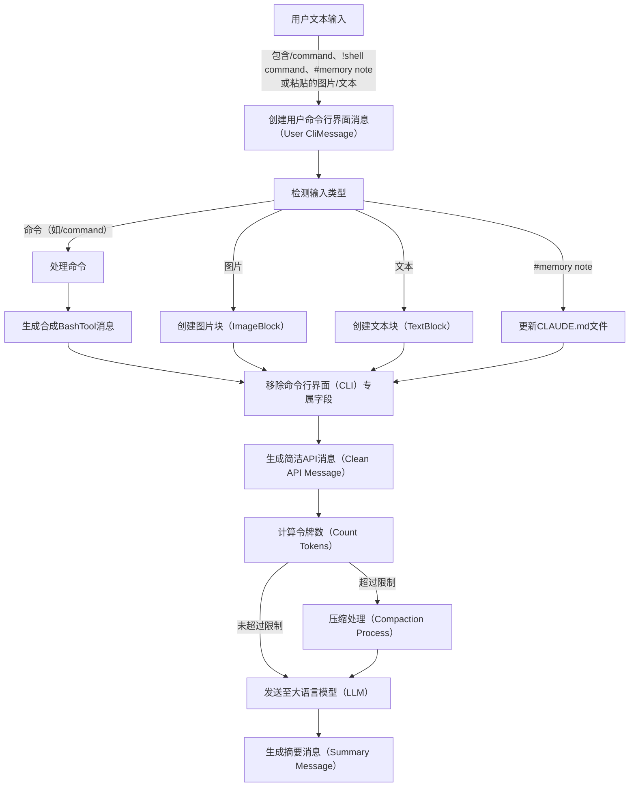
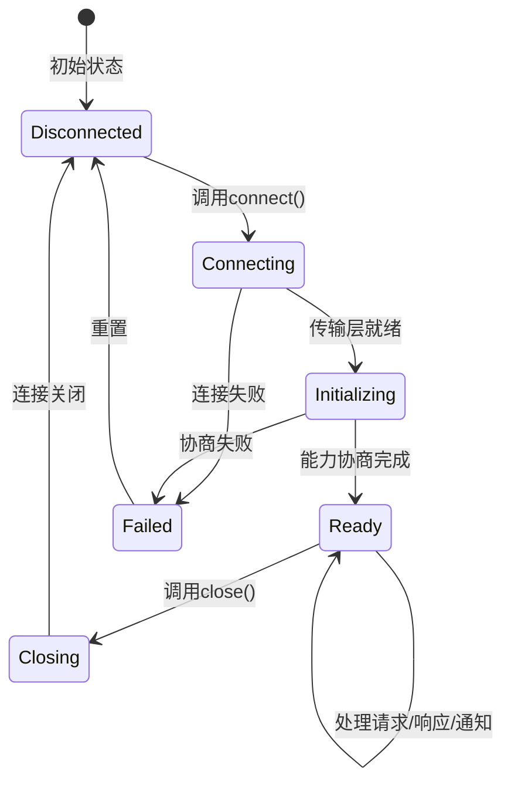

https://southbridge-research.notion.site/Data-Structures-The-Information-Architecture-2055fec70db1814ba2a7c5fa2879ac21


# 数据结构与信息架构
Mermaid（注：一种基于文本的图表绘制工具，可生成流程图、状态图等可视化图表）

预览 | 展开 | 复制

用户输入（UserInput）、命令行界面消息（CliMessage）、应用程序编程接口消息（APIMessage）、大语言模型流（LLMStream）、流事件（StreamEvent）、内容块增量（ContentBlockDelta）、累积消息（AccumulatedMessage）、工具使用块（ToolUseBlock）、工具执行（ToolExecution）、工具进度（ToolProgress）、工具结果（ToolResult）、工具结果块（ToolResultBlock）

1. 用户输入/粘贴内容
2. 命令行界面（CLI）处理输入
3. 格式化为大语言模型（LLM）可识别的格式
4. 发送应用程序编程接口（API）请求
5. 服务器发送数据块（chunks）
6. 解析增量数据（deltas）
7. 构建消息
8. 是否包含工具请求？
9. 执行工具
10. 生成进度信息
11. 进度更新
12. 完成执行
13. 格式化结果
14. 生成工具结果消息
15. 生成最终助手消息
16. 向用户展示内容
17. 循环继续


## 流式状态机：消息如何转换
Claude Code（注：推测为一款与代码相关的大语言模型工具）数据架构中最引人关注的一点，在于它如何在维持流式传输性能的同时，管理数据在多种表示形式间的转换。我们从其核心创新点开始分析：

TypeScript（注：一种强类型编程语言，是JavaScript的超集）

复制

```typescript
// 双重表示消息系统（基于分析推断）
interface MessageTransformPipeline {
  // 阶段1：命令行界面（CLI）内部表示
  cliMessage: {
    type: "user" | "assistant" | "attachment" | "progress"
    uuid: string // 命令行界面专属跟踪标识
    timestamp: string
    message?: APICompatibleMessage // 仅用于用户/助手类型
    attachment?: AttachmentContent // 仅用于附件类型
    progress?: ProgressUpdate // 仅用于进度类型
  }

  // 阶段2：应用程序编程接口（API）传输格式
  apiMessage: {
    role: "user" | "assistant"
    content: string | ContentBlock[] // 无命令行界面专属字段
  }

  // 阶段3：流式累加器
  streamAccumulator: {
    partial: Partial<APIMessage>
    deltas: ContentBlockDelta[]
    buffers: Map<string, string> // tool_use_id → 正在累加的JSON数据
  }
}
```

这一设计的重要性在于：三阶段表示法使Claude Code既能通过`CliMessage`元数据更新进度指示器，保证用户界面（UI）的响应性，又能通过简洁的`APIMessage`格式实现与大语言模型（LLM）的通信。


## 内容块（ContentBlock）：多态构建块
基于反编译分析，Claude Code为内容实现了一套复杂的类型系统：

TypeScript

复制

```typescript
// 内容块（ContentBlock）区分联合类型（重构所得）
type ContentBlock = 
  | TextBlock // 文本块
  | ImageBlock // 图片块
  | ToolUseBlock // 工具使用块
  | ToolResultBlock // 工具结果块
  | ThinkingBlock // 思考块
  | DocumentBlock // 文档块（平台专属）
  | VideoBlock // 视频块（平台专属）
  | GuardContentBlock // 保护内容块（平台专属）
  | ReasoningBlock // 推理块（平台专属）
  | CachePointBlock // 缓存点块（平台专属）

// 基于推断用法的性能标注
interface ContentBlockMetrics {
  TextBlock: {
    memorySize: "O(text.length)" , // 内存大小：与文本长度成正比
    parseTime: "O(1)" , // 解析时间：常数时间
    serializeTime: "O(n)" , // 序列化时间：与文本长度成正比
    streamable: true // 支持流式传输
  },
  ImageBlock: {
    memorySize: "O(1) + external" , // 内存大小：常数 + 外部存储（如base64编码/S3存储）
    parseTime: "O(1)" , // 解析时间：常数时间
    serializeTime: "O(size)" | "O(1) for S3" , // 序列化时间：与图片大小成正比；S3存储为常数时间
    streamable: false // 不支持流式传输
  },
  ToolUseBlock: {
    memorySize: "O(JSON.stringify(input).length)" , // 内存大小：与输入JSON字符串长度成正比
    parseTime: "O(n) for JSON parse" , // 解析时间：与JSON解析长度成正比
    serializeTime: "O(n)" , // 序列化时间：与内容长度成正比
    streamable: true // 支持流式传输（JSON可流式处理）
  }
}
```

### 流式JSON的挑战
Claude Code最巧妙的创新之一，是实现了对工具输入流式JSON的处理：

TypeScript

复制

```typescript
// 流式JSON解析器的推断实现
class StreamingToolInputParser {
  private buffer: string = ''; // 缓存区，用于存储待解析的JSON片段
  private depth: number = 0; // 用于跟踪JSON结构的嵌套深度
  private inString: boolean = false; // 标记是否处于字符串内部
  private escape: boolean = false; // 标记是否处于转义状态

  addChunk(chunk: string): ParseResult {
    this.buffer += chunk; // 将新接收的片段添加到缓存区

    // 跟踪JSON结构的嵌套深度
    for (const char of chunk) {
      if (!this.inString) {
        // 遇到左花括号或左方括号，深度加1
        if (char === '{' || char === '[') this.depth++;
        // 遇到右花括号或右方括号，深度减1
        else if (char === '}' || char === ']') this.depth--;
      }

      // 跟踪字符串边界（处理双引号包裹的字符串）
      if (char === '"' && !this.escape) {
        this.inString = !this.inString;
      }

      // 跟踪转义状态（处理反斜杠转义）
      this.escape = (char === '\\' && !this.escape);
    }

    // 当嵌套深度为0且缓存区非空时，尝试解析JSON
    if (this.depth === 0 && this.buffer.length > 0) {
      try {
        // 尝试完整解析JSON
        return { complete: true, value: JSON.parse(this.buffer) };
      } catch (e) {
        // 若处于字符串内部，尝试自动补全未闭合的字符串
        if (this.inString) {
          try {
            return { 
              complete: true, 
              value: JSON.parse(this.buffer + '"'), 
              repaired: true // 标记为已修复
            };
          } catch {
            // 补全后仍解析失败，不做处理
          }
        }
        // 解析失败，返回错误信息
        return { complete: false, error: e };
      }
    }

    // 嵌套深度未归0，解析未完成
    return { complete: false };
  }
}
```

该解析器能够处理从大语言模型（LLM）接收的增量JSON片段，一旦检测到JSON结构完整，便立即尝试解析。


## 消息生命周期：从用户输入到LLM再返回
Mermaid

预览 | 展开 | 复制



### 命令行界面消息（CliMessage）结构：不止表面所见
`CliMessage`类型是整个应用的“中枢神经系统”，其结构如下：

TypeScript

复制

```typescript
interface CliMessage {
  type: "user" | "assistant" | "attachment" | "progress" // 消息类型
  uuid: string // 唯一标识
  timestamp: string // 时间戳

  // 仅用于用户/助手类型消息
  message?: {
    role: "user" | "assistant" // 角色
    id?: string // 大语言模型（LLM）提供的标识
    model?: string // 响应的模型名称
    stop_reason?: StopReason // 生成停止的原因
    stop_sequence?: string // 触发停止的特定序列
    usage?: TokenUsage // 详细的令牌使用量
    content: string | ContentBlock[] // 消息内容
  }

  // 命令行界面（CLI）专属元数据
  costUSD?: number // 计算得出的成本（美元）
  durationMs?: number // API调用耗时（毫秒）
  requestId?: string // 用于调试的请求标识
  isApiErrorMessage?: boolean // 错误显示标记
  isMeta?: boolean // 系统生成消息标记

  // 各类型专属字段
  attachment?: AttachmentContent // 附件内容（仅附件类型）
  progress?: { // 进度信息（仅进度类型）
    toolUseID: string // 工具使用标识
    parentToolUseID?: string // 父工具使用标识（用于AgentTool子工具）
    data: any // 工具专属进度数据
  }
}

// 性能特征
interface CliMessagePerformance {
  creation: "O(1)" , // 创建时间：常数时间
  serialization: "O(content size)" , // 序列化时间：与内容大小成正比
  memoryRetention: "Weak references for large content" , // 内存保留：大内容使用弱引用
  garbageCollection: "Eligible when removed from history array" // 垃圾回收：从历史数组移除后可被回收
}
```

### 变异点与状态转换
Claude Code对数据结构的可修改位置进行了严格控制，具体实现如下：

TypeScript

复制

```typescript
// 推断的变异控制模式
class MessageMutationControl {
  // 变异点1：流累加（Stream accumulation）
  static accumulateStreamDelta(message: Partial<CliMessage>, delta: ContentBlockDelta): void {
    if (delta.type === 'text_delta') {
      // 获取消息内容的最后一个块
      const lastBlock = message.content[message.content.length - 1];
      if (lastBlock.type === 'text') {
        lastBlock.text += delta.text; // 变异操作：追加文本增量
      }
    }
  }

  // 变异点2：工具结果注入（Tool result injection）
  static injectToolResult(history: CliMessage[], toolResult: ToolResultBlock): void {
    // 创建新的工具结果消息
    const newMessage: CliMessage = {
      type: 'user',
      isMeta: true, // 标记为系统生成消息
      message: {
        role: 'user',
        content: [toolResult] // 内容为工具结果块
      },
      // ... 其他字段
    };
    history.push(newMessage); // 变异操作：将新消息添加到历史数组
  }

  // 变异点3：成本计算（Cost calculation）
  static updateCostMetadata(message: CliMessage, usage: TokenUsage): void {
    // 变异操作：更新消息的成本元数据
    message.costUSD = calculateCost(usage, message.model);
    // 变异操作：更新消息的耗时元数据
    message.durationMs = Date.now() - parseISO(message.timestamp);
  }
}
```


## 系统提示词：动态上下文组装
或许最复杂的数据结构，是动态组装的系统提示词，其实现如下：

TypeScript

复制

```typescript
// 系统提示词组装流程（重构所得）
interface SystemPromptPipeline {
  // 提示词来源
  sources: {
    baseInstructions: string // 静态基础指令
    claudeMdContent: ClaudeMdLayer[] // 分层的Claude.md内容
    gitContext: GitContextData // 实时Git上下文
    directoryStructure: TreeData // 目录结构（缓存/实时）
    toolDefinitions: ToolSpec[] // 可用工具定义
    modelAdaptations: ModelSpecificPrompt // 模型专属提示词
  },

  // 组装规则
  assembly: {
    order: ['base', 'model', 'claude.md', 'git', 'files', 'tools'] , // 组装顺序
    separators: Map<string, string> , // 分隔符映射（用于区分各部分）
    sizeLimit: number , // 令牌预算限制
    prioritization: 'recency' | 'relevance' // 优先级策略：按时间/按相关性
  }
}

// Git上下文结构，支持实时感知
interface GitContextData {
  currentBranch: string // 当前分支
  status: { // 工作区状态
    modified: string[] // 已修改文件列表
    untracked: string[] // 未跟踪文件列表
    staged: string[] // 已暂存文件列表
  }
  recentCommits: Array<{ // 最近提交记录
    hash: string // 提交哈希值
    message: string // 提交信息
    author: string // 提交作者
    timestamp: string // 提交时间戳
  }>
  uncommittedDiff?: string // 未提交的差异（计算成本高，按需获取）
}
```

### 内存布局：CLAUDE.md分层加载
纯文本

复制

```
项目根目录
├── .claude/
│   ├── CLAUDE.md（本地级 - 优先级最高）
│   └── settings.json（配置文件）
├── ~/（用户主目录）
│   └── .claude/
│       └── CLAUDE.md（用户级 - 优先级第二）
├── <project-root>/（项目根目录）
│   └── .claude/
│       └── CLAUDE.md（项目级 - 优先级第三）
└── /etc/claude-code/（系统目录）
    └── CLAUDE.md（管理级 - 优先级最低）
```

CLAUDE.md的加载机制实现了高效的合并策略，具体如下：

TypeScript

复制

```typescript
// 推断的CLAUDE.md加载算法
class ClaudeMdLoader {
  // 缓存：存储已加载的CLAUDE.md内容及修改时间
  private cache = new Map<string, { content: string, mtime: number }>();

  async loadMerged(): Promise<string> {
    // 加载层级（优先级从低到高）
    const layers = [
      '/etc/claude-code/CLAUDE.md', // 管理级
      '~/.claude/CLAUDE.md', // 用户级
      '<project>/.claude/CLAUDE.md', // 项目级
      '.claude/CLAUDE.md' // 本地级
    ];

    // 并行加载所有层级（使用缓存）
    const contents = await Promise.all(
      layers.map(path => this.loadWithCache(path))
    );

    // 按覆盖语义合并内容（高优先级覆盖低优先级）
    return this.mergeWithOverrides(contents);
  }

  private mergeWithOverrides(contents: string[]): string {
    // 后续层级（高优先级）覆盖前期层级（低优先级）
    // 支持@override指令：显式覆盖
    // 支持@append指令：追加内容
    // 默认行为：使用分隔符拼接所有内容
  }

  // 带缓存的加载方法（避免重复读取文件）
  private async loadWithCache(path: string): Promise<string> {
    // 省略实现：检查缓存是否有效，有效则返回缓存内容，无效则重新读取文件并更新缓存
  }
}
```


## 工具相关数据结构
### 工具定义（ToolDefinition）：完整工具接口
TypeScript

复制

```typescript
interface ToolDefinition {
  // 工具标识信息
  name: string // 工具名称
  description: string // 工具描述
  prompt?: string // 额外的大语言模型（LLM）指令

  // 输入 schema（双重表示）
  inputSchema: ZodSchema // 运行时验证（使用Zod库，一种TypeScript验证库）
  inputJSONSchema?: JSONSchema // 用于与LLM通信的JSON Schema

  // 执行逻辑（异步生成器，支持流式返回进度/结果）
  call: AsyncGenerator<ToolProgress | ToolResult, void, void>

  // 权限检查（可选）
  checkPermissions?: (
    input: any, 
    context: ToolUseContext, 
    permContext: ToolPermissionContext
  ) => Promise<PermissionDecision>

  // 输出格式化：将工具结果
```


映射为工具结果块参数
  mapToolResultToToolResultBlockParam: (result: any, toolUseId: string) => ContentBlock | ContentBlock[]

  // 元数据
  isReadOnly: boolean // 是否为只读工具（仅读取数据，不修改）
  isMcp?: boolean // 是否为多云/进程（MCP）相关工具
  isEnabled?: (config: any) => boolean // 工具启用状态判断（基于配置）
  getPath?: (input: any) => string | undefined // 获取工具操作的路径（可选）

  // 界面渲染：自定义工具使用消息的React渲染
  renderToolUseMessage?: (input: any) => ReactElement
}

// 工具定义的内存特征
interface ToolDefinitionMemory {
  staticSize: "~2KB per tool" , // 静态内存大小：每个工具约2KB
  zodSchema: "Lazy compilation, cached" , // Zod Schema：延迟编译，缓存存储
  jsonSchema: "Generated once, memoized" , // JSON Schema：生成一次，记忆化存储
  closures: "Retains context references" // 闭包：保留上下文引用
}


### 执行上下文：工具所需的全部信息
TypeScript

复制

```typescript
interface ToolUseContext {
  // 取消控制：用于中断工具执行
  abortController: AbortController

  // 文件状态跟踪：记录已读取文件的状态
  readFileState: Map<string, { 
    content: string // 文件内容
    timestamp: number // 最后修改时间（mtime）
  }>

  // 权限解析：获取工具权限上下文
  getToolPermissionContext: () => ToolPermissionContext

  // 选项集合：工具执行相关配置
  options: {
    tools: ToolDefinition[] // 可用工具列表
    mainLoopModel: string // 主循环使用的模型
    debug?: boolean // 调试模式开关
    verbose?: boolean // 详细日志开关
    isNonInteractiveSession?: boolean // 是否为非交互会话
    maxThinkingTokens?: number // 思考阶段的最大令牌数限制
  }

  // MCP连接：多云/进程通信客户端
  mcpClients?: McpClient[]
}

// 权限上下文：复杂的安全模型
interface ToolPermissionContext {
  mode: "default" | "acceptEdits" | "bypassPermissions" // 权限模式
  additionalWorkingDirectories: Set<string> // 额外工作目录（允许操作的目录）

  // 分层规则系统：不同优先级的权限规则
  alwaysAllowRules: Record<PermissionRuleScope, string[]> // 始终允许的规则
  alwaysDenyRules: Record<PermissionRuleScope, string[]> // 始终拒绝的规则
}

// 权限规则作用域（优先级从高到低）
type PermissionRuleScope = 
  | "cliArg" // 命令行参数（最高优先级）
  | "localSettings" // 本地配置
  | "projectSettings" // 项目配置
  | "policySettings" // 策略配置
  | "userSettings" // 用户配置（最低优先级）
```


## MCP协议结构
多云/进程（MCP）协议实现了一套复杂的远程过程调用（RPC）系统：

TypeScript

复制

```typescript
// 基于JSON-RPC 2.0的扩展协议
interface McpMessage {
  jsonrpc: "2.0" // 固定值，标识JSON-RPC版本
  id?: string | number // 请求/响应标识（通知消息可选）
}

// MCP请求消息
interface McpRequest extends McpMessage {
  method: string // 待调用的方法名
  params?: unknown // 方法参数（可选）
}

// MCP响应消息
interface McpResponse extends McpMessage {
  id: string | number // 必须包含，与请求id对应
  result?: unknown // 调用成功的返回结果（可选）
  error?: { // 调用失败的错误信息（可选）
    code: number // 错误码
    message: string // 错误描述
    data?: unknown // 额外错误数据（可选）
  }
}

// 能力协商结构：客户端与服务器交换支持的功能
interface McpCapabilities {
  experimental?: Record<string, any> // 实验性功能（键值对）
  roots?: boolean // 是否支持工作区根目录操作
  sampling?: boolean // 是否支持LLM采样委托
  prompts?: boolean // 是否支持动态提示词
  resources?: boolean // 是否支持资源服务
  tools?: boolean // 是否支持工具暴露
  logging?: boolean // 是否支持日志转发
}

// MCP服务器发送的工具规格
interface McpToolSpec {
  name: string // 工具名称
  description?: string // 工具描述（可选）
  inputSchema: JSONSchema // 输入结构（固定为JSON Schema）

  // MCP专属元数据
  isReadOnly?: boolean // 是否为只读工具
  requiresConfirmation?: boolean // 是否需要用户确认后执行
  timeout?: number // 执行超时时间（毫秒）
  maxRetries?: number // 最大重试次数
}
```

### MCP状态机
Mermaid

预览 | 展开 | 复制




## 会话状态：全局内存
TypeScript

复制

```typescript
interface SessionState {
  // 会话标识
  sessionId: string // UUID v4格式的唯一会话ID
  originalCwd: string // 初始工作目录（会话启动时的目录）
  cwd: string // 当前工作目录（可通过bash cd命令修改）

  // 成本跟踪（可变累加器）
  totalCostUSD: number // 会话总成本（美元）
  totalAPIDuration: number // 会话总API调用耗时
  modelTokens: Record<string, { // 各模型的令牌使用统计
    inputTokens: number // 输入令牌数
    outputTokens: number // 输出令牌数
    cacheReadInputTokens: number // 缓存读取的输入令牌数
    cacheCreationInputTokens: number // 缓存创建的输入令牌数
  }>

  // 模型选择
  mainLoopModelOverride?: string // 主循环模型覆盖（优先级高于默认）
  initialMainLoopModel?: string // 初始主循环模型

  // 活动指标
  sessionCounter: number // 会话计数器
  locCounter: number // 代码行数计数器（生成/处理的代码行数）
  prCounter: number // 拉取请求（PR）计数器
  commitCounter: number // Git提交计数器

  // 状态标记
  lastInteractionTime: number // 最后交互时间（时间戳）
  hasUnknownModelCost: boolean // 是否存在未知成本的模型
  maxRateLimitFallbackActive: boolean // 是否启用最大速率限制降级策略

  // 可用模型列表
  modelStrings: string[] // 支持的模型名称列表
}

// 会话状态访问模式（推断）
class SessionManager {
  // 单例模式：全局唯一的会话状态
  private static state: SessionState;

  // 更新会话状态（泛型方法，确保类型安全）
  static update<K extends keyof SessionState>(key: K, value: SessionState[K]): void {
    this.state[key] = value;
    this.persistToDisk(); // 异步持久化到磁盘（非阻塞）
  }

  // 计数器增量更新（仅支持数值类型的状态字段）
  static increment(metric: keyof SessionState): void {
    if (typeof this.state[metric] === 'number') {
      this.state[metric]++;
    }
  }

  // 持久化到磁盘（省略具体实现）
  private static persistToDisk(): void {
    // 异步写入本地文件（如~/.claude/sessions/{sessionId}.json）
  }
}
```


## 双向流实现
平台级的双向流采用了一套复杂的协议，具体结构如下：

TypeScript

复制

```typescript
// 双向流传输负载结构
interface BidirectionalStreamingProtocol {
  // 客户端 → 服务器：客户端发送的负载
  clientPayload: {
    bytes: string // Base64编码的二进制数据
    encoding: 'base64' // 固定编码格式
    // 解码后的内容类型
    contentTypes: 
      | ContinuedUserInput // 续传的用户输入
      | ToolResultBlock // 工具结果块
      | ConversationTurnInput // 对话轮次输入
  }

  // 服务器 → 客户端：服务器发送的负载
  serverPayload: {
    bytes: string // Base64编码的二进制数据
    encoding: 'base64' // 固定编码格式
    // 解码后的事件类型
    eventTypes: 
      | ContentBlockDeltaEvent // 内容块增量事件
      | ToolUseRequestEvent // 工具使用请求事件
      | ErrorEvent // 错误事件
      | MetadataEvent // 元数据事件
  }
}

// 双向流状态机（处理流数据）
class BidirectionalStreamManager {
  private encoder = new TextEncoder(); // 文本编码（UTF-8）
  private decoder = new TextDecoder(); // 文本解码（UTF-8）
  private buffer = new Uint8Array(65536); // 64KB大小的字节缓存区

  // 处理可读流（异步生成器，逐事件返回）
  async * processStream(stream: ReadableStream) {
    const reader = stream.getReader(); // 获取流读取器
    let partial = ''; // 存储未完整处理的文本片段

    while (true) {
      // 读取流数据（直到流结束或出错）
      const { done, value } = await reader.read();
      if (done) break; // 流结束，退出循环

      // 解码二进制数据，并保留流状态（避免截断多字节字符）
      partial += this.decoder.decode(value, { stream: true });
      // 按换行符分割（符合服务器发送事件SSE格式）
      const lines = partial.split('\n');
      // 保留最后一个不完整的行（下一轮继续处理）
      partial = lines.pop() || '';

      // 处理每一行完整数据
      for (const line of lines) {
        // SSE格式中，数据行以"data: "开头
        if (line.startsWith('data: ')) {
          // 提取并解析JSON格式的负载
          const payload = JSON.parse(line.slice(6));
          // 解码负载并 yield 给调用者
          yield this.decodePayload(payload);
        }
      }
    }
  }

  // 解码负载数据（Base64 → JSON）
  private decodePayload(payload: any) {
    // 将Base64字符串解码为Buffer
    const bytes = Buffer.from(payload.bytes, 'base64');
    // 进一步解码为JSON对象（根据协议约定）
    return JSON.parse(bytes.toString());
  }
}
```


## 数据结构中的性能优化
### 1. 通用值的字符串驻留（String Interning）
TypeScript

复制

```typescript
// 推断的字符串驻留模式（避免重复存储相同字符串）
class StringIntern {
  // 字符串池：存储已驻留的字符串（键值相同，避免重复）
  private static pool = new Map<string, string>();

  // 驻留方法：若字符串已存在则返回池中的引用，否则添加到池中
  static intern(str: string): string {
    if (!this.pool.has(str)) {
      this.pool.set(str, str);
    }
    return this.pool.get(str)!;
  }
}

// 在消息处理中的使用场景
message.type = StringIntern.intern(rawType); // 如'user'、'assistant'等固定类型
message.stop_reason = StringIntern.intern(reason); // 如'end_turn'、'tool_use'等固定原因
```

**优化目的**：减少重复字符串的内存占用，同时加速字符串比较操作（引用比较替代值比较）。


### 2. 内容块的延迟解析（Lazy Content Block Parsing）
TypeScript

复制

```typescript
// 内容块采用延迟解析以提升性能（避免不必要的解析开销）
class LazyContentBlock {
  private _raw: string; // 存储原始未解析数据（如JSON字符串）
  private _parsed?: any; // 存储解析后的结果（延迟初始化）

  // 构造函数：仅存储原始数据，不立即解析
  constructor(raw: string) {
    this._raw = raw;
  }

  // 访问器：首次访问时才解析，后续直接返回缓存结果
  get content() {
    if (!this._parsed) {
      this._parsed = this.parse(this._raw);
    }
    return this._parsed;
  }

  // 私有解析方法：封装解析逻辑（可能包含复杂处理）
  private parse(raw: string): any {
    // 仅在首次访问content时执行昂贵的解析操作
    return JSON.parse(raw);
  }
}
```

**优化目的**：避免对未使用的内容块进行解析，减少初始化时间和内存占用（如仅预览消息列表时，不解析完整内容）。


### 3. 读取文件状态的弱引用（ReadFileState Weak References）
TypeScript

复制

```typescript
// 文件缓存采用弱引用，实现自动内存管理
class ReadFileState {
  // 缓存：键为文件路径，值为文件内容的弱引用
  private cache = new Map<string, WeakRef<FileContent>>();
  // 终结器注册表：当文件内容被垃圾回收时，自动从缓存中删除路径
  private registry = new FinalizationRegistry((path: string) => {
    this.cache.delete(path);
  });

  // 存储文件内容到缓存
  set(path: string, content: FileContent) {
    const ref = new WeakRef(content); // 创建弱引用
    this.cache.set(path, ref);
    // 注册终结器：当content被回收时，删除对应的缓存项
    this.registry.register(content, path);
  }

  // 从缓存获取文件内容
  get(path: string): FileContent | undefined {
    const ref = this.cache.get(path);
    if (ref) {
      const content = ref.deref(); // 尝试获取弱引用指向的对象
      if (!content) {
        this.cache.delete(path); // 若对象已被回收，清理缓存项
      }
      return content;
    }
    return undefined;
  }
}

// 文件内容接口（示例）
interface FileContent {
  content: string;
  timestamp: number;
}
```

**优化目的**：避免缓存的文件内容长期占用内存——当文件内容不再被其他部分引用时，可被垃圾回收机制自动清理，平衡缓存效率与内存占用。
